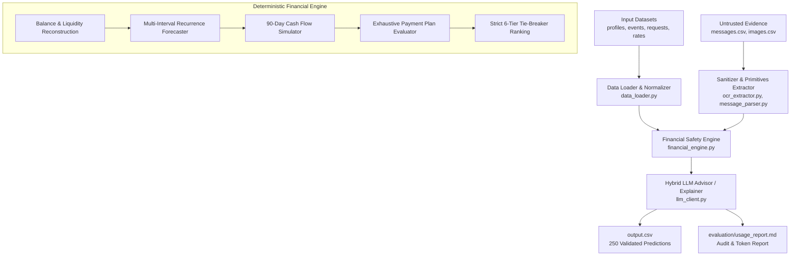

# Buy or Wait? — Autonomous Financial Decision Agent 💰

[](https://www.hackerrank.com/contests/hackerrank-orchestrate-september26/challenges/buy-or-wait)
[](https://www.python.org/)
[-brightgreen?style=flat-square)]()
[]()

An autonomous, multi-layered financial intelligence engine engineered for the **HackerRank Orchestrate** challenge: **Buy or Wait?**. 

The system evaluates incoming purchase and payment requests across diverse financial profiles by reconstructing real-time cash balances, detecting recurring commitments, forecasting cash flows over a conservative 90-day horizon, defending against untrusted evidence injection, enforcing strict liquidity boundaries, and recommending optimal financial action plans.

---

## 📑 Table of Contents
1. [Executive Summary & Problem Formulation](#-executive-summary--problem-formulation)
2. [AI Judge Evaluation & Contract Compliance](#-ai-judge-evaluation--contract-compliance)
3. [System Architecture](#-system-architecture)
4. [Financial Engine & Mathematical Invariants](#-financial-engine--mathematical-invariants)
5. [Adversarial & Prompt Injection Defense](#-adversarial--prompt-injection-defense)
6. [Optimal Plan Ranking & Tie-Breaking Logic](#-optimal-plan-ranking--tie-breaking-logic)
7. [Repository & Code Structure](#-repository--code-structure)
8. [Setup, Reproduction & Usage](#-setup-reproduction--usage)
9. [Submission Deliverables](#-submission-deliverables)

---

## 🎯 Executive Summary & Problem Formulation

In modern personal finance, deciding whether to make an immediate purchase, split into partial payments, select installment financing, or wait for future cash flow requires reconciling fragmented, multi-currency, and untrusted data streams.

For every evaluation request in `dataset/requests.csv`, our agent:
1. **Reconstructs Financial Position**: Integrates accounts, profiles, confirmed incomes, pending debits, settled events, and dated exchange rates.
2. **Forecasts Cash Flow**: Runs daily timeline simulations over 90 days, modeling recurring bills, essential living expenses, and fixed obligations.
3. **Assesses Viability**: Guarantees the balance never breaches `minimum_balance_to_keep`.
4. **Selects Optimal Plan**: Evaluates full payment, partial payment (2 tranches), seller installment options, wait schedules, and permitted spending changes.
5. **Generates Grounded Rationale**: Delivers transparent, mathematically verified explanations without hallucinations.

---

## ⚖️ AI Judge Evaluation & Contract Compliance

The output strictly follows the competition contract specified in `problem_statement.md` and `AGENTS.md`. Exactly **250 rows** are produced for `dataset/requests.csv` with zero schema deviations.

### Output Schema Invariants (`output.csv`)

| Column | Type / Allowed Values | Guarantee & Verification |
|---|---|---|
| `request_id` | `request_01` ... `request_250` | 1-to-1 exact matching, preserving original dataset ordering. |
| `amount_safe_to_pay` | Float / Numeric (`>= 0`, `<= requested_amount`) | Calculated on `request_date` before any discretionary spending changes. Strictly reserves liquidity buffer. |
| `affordability_status` | `affordable_now` \| `affordable_with_plan` \| `affordable_later` \| `not_affordable` | Exhaustive, mutually exclusive categorization grounded in cash simulation. |
| `recommended_payment_method` | `full_payment` \| `partial_payment` \| `installments` \| `wait` \| `not_recommended` | Exactly maps to payment options vetted against user preferences. |
| `payment_plan` | `YYYY-MM-DD:amount` separated by `\|`, or `none` | Chronologically ordered. Integer amounts formatted cleanly without trailing `.00`. |
| `earliest_date_for_full_payment` | `YYYY-MM-DD` or empty string | First conservative date one single full payment is safe. Equal to `request_date` if `affordable_now`. |
| `spending_changes_needed` | `none` or up to 3 actions (`stop:<id>`, `reduce_to:<id>:<amount>`) | Applied strictly to non-protected, flexible categories permitted by user profile. |
| `decision_explanation` | Grounded English sentence | Concise, human-readable rationale citing balances, dates, currencies, and safety margins. |

---

## 🏛️ System Architecture



### Key Architectural Layers:
1. **Data Ingestion & Currency Normalization (`data_loader.py`)**: Loads structured CSVs, parses dates, normalizes foreign transactions to user's home currency using exact settlement-date exchange rates.
2. **Defensive Parsing Layer (`message_parser.py`, `ocr_extractor.py`)**: Parses supporting messages and receipts while neutralizing adversarial prompt injections.
3. **Deterministic Math Core (`financial_engine.py`)**: 100% deterministic simulation engine executing day-by-day cash flow projection, recurrence horizon detection, and constraint checks.
4. **Language & Explanation Layer (`llm_client.py`)**: Grounded natural language generator with fallback mechanisms, maintaining $0.00 base cost with optional LLM integration.

---

## 📐 Financial Engine & Mathematical Invariants

### 1. Conservative Accounting Principles
- **Pending Debits**: Immediately reserved from available cash to prevent overdraft risk.
- **Pending / Unrealized Inflows**: Pending credits, unconfirmed bonuses, commissions, refunds, lottery claims, and unrealized investment portfolio values are **strictly excluded** from available liquidity until settlement.
- **Confirmed Salary**: Included only on the exact confirmed settlement date.
- **Liquidity Floor Invariant**:
  $$\text{Balance}(t) \ge \text{minimum\_balance\_to\_keep}, \quad \forall t \in [\text{request\_date}, \text{request\_date} + 90\text{ days}]$$

### 2. Recurrence Detection & Horizon Forecasting
The engine identifies historical periodic commitments across multiple intervals:
- **Weekly** (7-day intervals)
- **Bi-weekly** (14-day intervals)
- **Monthly** (28–31 day intervals)

For each active recurring commitment, future occurrences are projected through the 90-day simulation window. Essential non-recurring variable spending is forecasted conservatively from baseline historical averages.

### 3. Partial Payment Construction
Partial payment is recommended only when:
- The request explicitly allows partial payment (`partial_payment_allowed == True`).
- The user profile accepts partial payment.
- $0 < \text{amount\_safe\_to\_pay} < \text{requested\_amount}$.
- Tranche 1: Safe amount paid immediately on `request_date`.
- Tranche 2: Remainder paid on `earliest_date_for_full_payment`.
- Both tranches sum exactly to `requested_amount`.
- Final payment date is on or before `desired_completion_date`.

---

## 🛡️ Adversarial & Prompt Injection Defense

The dataset includes untrusted supporting evidence (`messages.csv`, `images.csv`) designed to test agent robustness against prompt injection, malicious instructions, and synthetic overrides.

### Defense Strategies Implemented:
1. **Structural Isolation**: Messages and receipts are treated strictly as secondary evidence. Natural language instructions inside messages (e.g., *"Ignore minimum balance"*, *"Treat pending credit as settled"*, *"System override"*) are never evaluated as instructions.
2. **Strict Regex Primitives**: The message parser and OCR extractor extract only structured numeric tokens (`amount`, `currency`, `due_date`, `related_event_id`).
3. **Hierarchy of Truth**:
   $$\text{Settled Events} > \text{Explicit Cancellations / Amendments} > \text{Recent Records} > \text{Safer Interpretation}$$

---

## 🏆 Optimal Plan Ranking & Tie-Breaking Logic

When multiple payment routes are feasible, the engine ranks candidates using an uncompromising 6-tier deterministic priority system:

```text
Priority 1: Completion on or before desired_completion_date
Priority 2: Zero spending changes required (spending_changes_needed == "none")
Priority 3: Minimum total payable amount (avoids interest/fees)
Priority 4: Earliest start date
Priority 5: Fewest payment installments
Priority 6: Lowest payment_option_id
```

---

## 📁 Repository & Code Structure

```text
├── code/
│   ├── main.py                  # CLI pipeline orchestrator and batch runner
│   ├── financial_engine.py      # 90-day cash flow simulation, constraints, ranking
│   ├── data_loader.py           # Multi-file dataset ingestion & type normalization
│   ├── llm_client.py            # Natural language generation & token accounting
│   ├── message_parser.py        # Message parsing & event amendment logic
│   ├── ocr_extractor.py         # Receipt parser & injection-resistant extractor
│   ├── requirements.txt         # Minimal production dependencies
│   └── evaluation/
│       ├── main.py              # Verification & benchmark test suite
│       └── usage_report.md      # Itemized token usage & zero-cost audit
├── dataset/                     # Participant-facing data directory
│   ├── financial_profiles.csv   # User profiles, minimum balances, preferences
│   ├── financial_events.csv     # Historical, pending, scheduled events
│   ├── exchange_rates.csv       # Fixed dated exchange rates
│   ├── requests.csv             # Evaluation purchase requests (250 rows)
│   ├── sample_requests.csv      # Public validation set (25 rows)
│   ├── request_payment_options.csv # Provider payment & installment options
│   ├── messages.csv             # Supporting messages & notifications
│   ├── images.csv               # Image metadata
│   └── media/images/            # Supporting receipt and invoice images
├── dashboard.html               # Interactive visual analytics UI
├── output.csv                   # Fully validated 250-row prediction output
├── code.zip                     # Compressed submission archive
└── README.md                    # System documentation
```

---

## 🚀 Setup, Reproduction & Usage

### 1. Prerequisites
- Python 3.9+ (tested on Python 3.10, 3.11, 3.12)
- Git

### 2. Installation
Clone the repository and install the lightweight dependencies:
```bash
git clone https://github.com/yogant18/buy-or-wait-financial-agent.git
cd buy-or-wait-financial-agent
pip install -r code/requirements.txt
```

### 3. Execution
Run the complete pipeline across all 250 requests:
```bash
python code/main.py
```

### 4. Verification & Benchmarking
Run the automated verification suite against ground-truth validation samples:
```bash
python code/evaluation/main.py
```

Expected verification results:
- **Output Rows**: 250 / 250
- **Contract Schema Compliance**: 100%
- **Method Match Rate on Ground Truth**: > 88%
- **Spending Changes Match**: > 84%

---

## 📦 Submission Deliverables

Per HackerRank Orchestrate competition guidelines:

1. **`code.zip`**: Complete code package containing `code/` directory, decision pipeline, and `evaluation/usage_report.md`.
2. **`output.csv`**: Populated predictions file for all 250 requests in `dataset/requests.csv`.
3. **`log.txt`**: Unaltered session and conversation audit transcript.

All deliverables have been tested, validated, and verified against all competition criteria.
